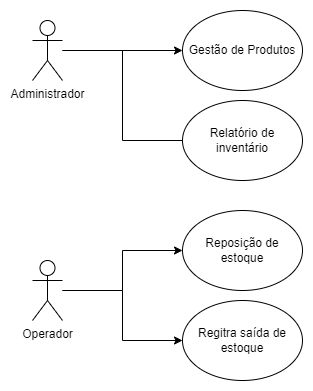
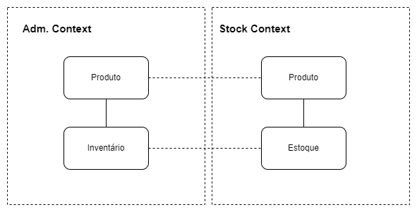
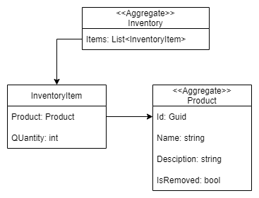
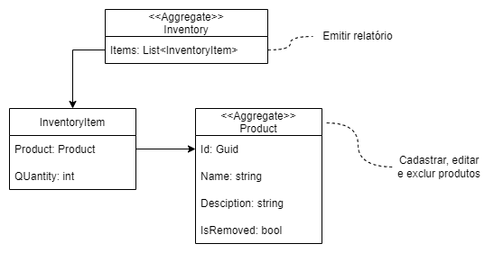

Olá, me chamo Anna, sou Desenvolvedora de Software há 9 anos e criei esse projeto para compartilhar ensinamentos que eu demorei muito para finalmente entender. O projeto utiliza os principais conceitos do DDD e alguns padrões adjacentes como o Factory Pattern. Outra ferramenta que hoje eu percebo que é muito poderosa mas que eu nunca a valorizei como deveria é o TDD, por isso aqui você vai encontrar testes para todo lado.

Não pretendo focar ainda na camada de distribuição, meu desafio é fazer um sistema completamente testável e focado no domínio e para isso não preciso dessa camada ;)

Vou manter [meu blog](https://dev.to/devannalaura) explorando todos os conceitos que abordo aqui, espero que goste!

## Sobre o negócio

O objetivo é criar um sistema de controle de estoque, o sistema será simples mas terá dois atores: administrador e o operador. As interações dos meus atores com o sistema estão explicadas nos casos de uso abaixo:

## Bounded Context

Com base no comportamento de meus atores, modelei dois Bounded Context's sendo eles o Administration Context e o Stock Context.

Provavelmente a primeira impressão que você tem ao olhar o mapa acima é que estamos repetindo as entidades nos dois contextos (assim como as linhas pontilhadas indicam) mas percebam que para cada contexto eu mantenho a linguagem ubíqua daquele contexto, ou seja, meu administrador tem uma visão de Inventário que o operador chama de Estoque, no fim são a mesma coisa mas como nossos atores chamam de forma diferente é assim que vamos tratar dentro dos Bounded Context's, mais pra frente eu juro que isso tudo vai fazer sentido. Vamos entender melhor sobre o que cada contexto é responsável:

- Stock Context: responsável pelo fluxo de entrada e saída dos produtos, funcionalidades importantes para atores com responsabilidade de operação.

## Administration Context
Responsável por manter o cadastro dos produtos que o sistema controlará, através desse contexto será possível cadastrar, editar ou excluir produtos e emitir um relatório de status do inventário, funcionalidades cruciais para atores que possuem a responsabilidade de administração.

Para atender a esses requisitos a modelagem de classes ficou da seguinte maneira:

A sinalização de `aggregate` que você vê acima indica que essas classes são responsáveis pelos principais comportamentos do contexto, ou seja, tudo que é feito ocorre através dela. Para ficar mais claro, veja a imagem abaixo:

